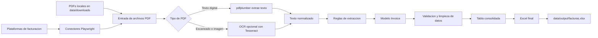

# Flujo del sistema

Este diagrama muestra como viajan los datos desde la descarga o carga local de facturas hasta el reporte final en Excel.

## Etapas

| Etapa | Componente | Entrada | Salida |
| --- | --- | --- | --- |
| Descarga | `connectors/*` | Credenciales y portal web | PDFs descargados |
| Entrada local | `data/downloads` | PDFs ya descargados | Lista de archivos PDF |
| Lectura | `extractor.py` | PDF | Texto de factura |
| OCR opcional | `extractor.py` | PDF escaneado | Texto reconocido |
| Extraccion | `extractor.py` | Texto | Campos estructurados |
| Modelo comun | `models.py` | Campos extraidos | Objeto `Invoice` |
| Exportacion | `exporter.py` | Lista de `Invoice` | Excel consolidado |
| Reporte final | `data/output` | DataFrame formateado | `facturas.xlsx` |

## Flujo operativo

1. El usuario ejecuta `facturas run-platform <plataforma>` o `facturas extract-local`.
2. Si se usa una plataforma, el conector entra al portal, aplica los pasos de navegacion y descarga los PDFs.
3. El extractor lee cada PDF. Si no encuentra texto suficiente, intenta OCR si las dependencias estan instaladas.
4. Las reglas identifican numero de factura, fecha, NIT, subtotal, impuestos, total y moneda.
5. Cada factura se convierte en un modelo `Invoice` con una estructura comun.
6. El exportador consolida todas las facturas en una tabla.
7. El sistema genera el Excel final en `data/output`.

## Puntos de extension

- Para agregar otro portal, crear un nuevo conector en `src/invoice_automation/connectors/`.
- Para ajustar campos segun un proveedor, modificar o ampliar reglas en `extractor.py`.
- Para cambiar columnas del reporte, editar `Invoice.to_excel_row()` en `models.py`.
